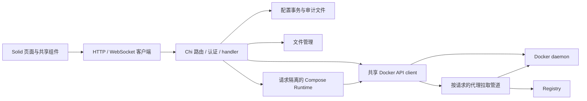

# 全仓代码审计与执行计划

日期：2026-09-05。基线：`cb849e7`，开始时工作区干净。审计/验收负责人：主代理；修复/测试执行：GPT-5.6-Luna，max。

## 范围与结论

覆盖仓库 152 个跟踪文件的目录、依赖、入口与测试配置；重点追踪 Go HTTP → Docker/Compose/文件/Store 调用链、WebSocket 生命周期、前端请求/轮询/上传下载/日志/容器表单，以及构建和部署脚本。统计的 Go、TS/TSX 源码及测试约 17,833 行（不含锁文件和依赖）。这是源码审计和本地验证，不是生产压测、渗透测试或所有 UI 组合的穷举证明。知识图谱 MCP 在本会话未暴露，已按 AGENTS.md 回退源码检索。

结论：当前有数据损失、生命周期泄漏、错误报告成功和质量门禁失效问题，应先修这些根因。现有模块边界可以保留，不需要改成微服务或另建通用框架。Compose 官方 API 的请求隔离、项目操作锁，以及代理拉取的管道/校验/取消机制已有实质价值，不应为缩短代码删除。

解耦方向：认证通过当前用户查找回调读取账户，不依赖 API；文件限制与路径规则由共享 helper 执行；流取消/写入期限由 WebSocket 层负责，Compose 消费者复用。保持 HTTP 状态/审计在 API，Docker 操作与回滚在 docker/container，页面只消费接口结果。收敛不仅指减少重复代码，也包括同一项目/容器拒绝重叠变更、重复升级可继续找到原始镜像引用，以及失败时不发布虚假的成功状态。

## 基线检查

| 检查 | 实际结果 |
| --- | --- |
| `go test ./...` | 失败：`TestImageImportAndPruneUseRemoteSourceAndUnusedFilter` 的 Server 测试实例没有 audit，调用 Logger.Log 空指针崩溃 |
| `go vet ./...` | 通过 |
| `cd web && npm test -- --reporter=dot` | 15 文件 / 46 测试通过；Sparkline 测试有 jsdom canvas 未实现噪声 |
| `cd web && npx tsc --noEmit` | 失败：6 条错误，涉及测试夹具、路由参数、Set 泛型和未使用导入 |
| `cd web && npm run build` | 通过，但不做类型检查；单个 JS 1,505.51 kB，gzip 457.45 kB，CSS 34.95 kB |
| `cd web && npm audit --omit=dev` | 失败：`composerize → composeverter → ajv → fast-uri` 锁定 3.1.3，报告 1 个 high 且有 3.1.6 修复版 |
| `govulncheck ./...` | 失败：报告代码可达的 7 个漏洞 / 4 个模块；集中在 Docker CLI/Engine、BuildKit 和 go-archive 依赖链，其中若干无当前兼容修复版 |
| 真实 Docker 验收 | 当前 `docker` 命令不存在；验收测试由环境变量控制，默认跳过，不计为真实通过 |

## 发现与修复契约

P1：数据/权限/进程资源问题；P2：功能正确性与明显损耗；P3：已知上限或架构后续项。位置为基线符号和文件，避免修复后行号漂移。

| ID / 级别 | 证据、触发与影响 | 修复及验收 |
| --- | --- | --- |
| A01 P1 | `store.Store.Read/Write` 分别加锁，所有用户/仓库/模板/Compose handler 都是锁外读改写；并发请求读到同一快照，后写者覆盖先写者。直接 WriteFile 截断配置，写失败可能破坏旧文件 | 单进程 Update 事务覆盖全部生产写入；同目录临时文件+同步+重命名；并发跨集合更新不丢失，失败保留旧配置 |
| A02 P1 | users/registries/compose 用 `len+1` 生成 ID：1,2,3 删除 2 再添加得到重复 3。多个 store.Read 错误被忽略；模板删除忽略写错误 | 已安装 UUID 或随机 ID；所有读写错误显式传播；删除再新增唯一、损坏配置不 panic、不返回虚假成功 |
| A03 P1 | `cmd/server/main.go/seed.go` 无配置时使用公开 JWT key 和 admin/admin；compose 示例没有覆盖它们 | 首次启动要求管理员密码；JWT secret 使用安全显式配置或受保护持久随机值，禁止公开默认；部署文档同步，已有账户不重置 |
| A04 P1 | `auth.Middleware` 与 `wsAuth` 只相信 JWT 内角色；用户被删/降权/改密后旧票据仍最多有效 24h；两套 context key 使 WS/download 审计身份丢失 | 统一 claims context 和当前账户验证；按账户版本撤销旧票据；测试 REST 和 query token 权限变更/删除/改密 |
| A05 P2 | Docker/Compose 所有 REST GET 都放 Operator 组，Viewer UI 却提供容器/概览/镜像入口；合法 viewer 看到 403。这也违反既有设计中“Viewer = 只读 GET + 日志/事件 WebSocket、无终端”的权限契约 | 所有业务 GET（含只读文件、导出下载）迁给 Viewer；用户/审计仍 Admin，终端与全部变更仍 Operator+；权限矩阵测试避免遗漏和重复注册 |
| A06 P1 | `ws.Logs/Stats/Events` 未读取关闭帧；日志/事件忽略 WriteMessage 错误；Terminal 的 cancel 不能解除 conn.ReadMessage 阻塞；日志未处理 Docker multiplex framing，Stats 用 io.Copy 按任意字节块分 WS 帧 | 关闭帧取消上游、关闭 reader/socket、单写者与写超时；非 TTY 用 stdcopy 解复用；Stats 每帧完整 JSON；安静流断开/拆包/终端 EOF 回归 |
| A07 P1 | `LogsView` 每消息重设 80ms timer，是防抖而非节流；持续高速日志永不 flush，buf 无上限；重连旧 buf 未清理 | 固定节流窗口、缓冲和显示双上限、清空/重连隔离、UTF-8 流式解码；持续流仍定期更新且内存有界 |
| A08 P1 | `container.Upgrade` Stop→Remove→Create→Start，Create/Start 失败旧容器已丢失；Duplicate/Upgrade 忽略 NetworkingConfig，匿名卷可能不复用；升级创建用浮动 tag | 先准备替代容器，保留旧容器至成功，失败恢复名称/运行状态；固定已校验 image ID，保留网络和卷；不支持安全回滚的 AutoRemove 提前拒绝；失败路径回归 |
| A09 P1 | config/fs/compose PutFile 使用 LimitReader(limit)，超限静默写入前 N 字节并返回成功；容器上传 ReadAll 后 CreateTar 再整份复制，无内存上限 | 超限 413 且旧文件不变；原子替换保留 mode 与 UID/GID；容器上传临时文件/流式 tar，校验文件名和长度、清理资源；边界与取消测试 |
| A10 P2 | `isSubPath` 只比较字符串，跟随中间 symlink 可离开声明根目录；`streamTar` symlink linkname 为空并尝试打开目标，特殊文件可阻塞；路径前缀 `..foo` 被误拒 | 根内文件操作使用标准库安全根机制或明确阻止 symlink 路径；保留正常名字；tar 保存链接而不读取目标，拒绝特殊文件；说明 /api/fs 本身有意提供 Operator 全盘权限，此项不是 Operator→Admin 越权宣称 |
| A11 P1 | `clearContainerMemoryLimit` 启动 privileged alpine，直接 sed Docker 私有 hostconfig，cgroup 错误 `|| true` 吞掉；daemon 内存状态和磁盘可能分叉、错误返回成功 | 删除非公开内部写入路径；不支持在线清零时在任何变更前返回明确错误，提示通过重建修改；测试无 privileged helper/无部分更新 |
| A12 P2 | 容器 rename 忽略 JSON/Docker 错误；文件 rm/mv 只确认 exec start 不确认退出码；命令路径无 `--`；若干 image/network JSON 错误也忽略 | 共享最小 exec 检查，参数边界验证、退出非零返回失败；不在各 handler 复制协议逻辑 |
| A13 P2 | `createResourceStore` 每 5 秒 setInterval，无进行中请求去重，慢响应会并发且旧值覆盖；隐藏页面持续轮询；概览 5 请求/5s，间接至少 4 次 ContainerList/5s | 单个 store 仅一个请求，隐藏暂停、恢复刷新、销毁抑制迟到更新；测试慢请求/隐藏/停止。跨接口快照缓存暂不引入 |
| A14 P2 | `CreateContainerModal` 模块顶层 createResource 拉镜像，在登录前执行；401 清 token，列表之后也不会因打开更新；App Guard 事件监听不清理 | 组件内按打开状态取资源，监听有清理，401 同步用户状态；鉴权/打开刷新/卸载回归 |
| A15 P2 | `ContainerStats` 每帧丢弃半条 JSON；网络第一点用累计字节作为速率，后续未除采样时间；id 改变未重连 | 后端完整帧契约，前端按 read 时间算字节每秒，首帧只建立基线；id 改变重置/重连，计数回退和时间间隔测试 |
| A16 P2 | `streamDownload` 持有全部 chunks 再 Blob，大文件内存 O(文件大小)；PullStatusWidget notes/layerMap 无界，XHR responseText 持续累计 | 下载优先浏览器磁盘流，兼容回退设明确大小上限并取消 reader；进度显示与响应设置有限上限并可解释地失败，保留上传进度；测试过限/错误清理 |
| A17 P2 | images/volumes 忽略 ContainerList 错误，Compose 列表吞 daemon discovery 错误，显示错误的“未使用/未运行” | 明确报告不可用，禁止把未知状态当空集合；失败回归 |
| A18 P2 | A01 前提下用户仍允许空名/无效角色/重复名，删除最后管理员会失去管理入口；registry test 返回 200 的未实现状态 | 事务内唯一/角色/最后管理员验证；未实现接口返回 501；回归验证状态码 |
| A19 P2 | Go 测试夹具漏依赖；build 只转译而不 typecheck | 修测试实例，不用生产 nil guard 掩盖必需依赖；修类型错误并把 tsc 纳入 build，保留可运行质量检查命令 |
| A20 P3 | audit.ReadAll 全文件读入且持锁，日志持续增长；Log 打开/写错误静默；tabs.seenPaths 永不释放 | 本次做有限尾部响应及写错误可观测/释放已关闭标签标记；磁盘轮转与分页按部署保留策略另行实施，记录线性扫描上限 |
| A21 P3 | 所有页面静态导入，登录首包也含 xterm/CodeMirror/转换器；前端 store 导入 Sidebar、api/ws 导入 Toast，存在反向 UI 耦合；大页面 600–810 行、compose handler 1022 行 | 本次可用原生 lazy 页面分包；只在有真实重复/依赖环时提取共享常量，禁止为文件长度建立多层框架。构建对比入口体积 |
| A22 P3 | CLI 表单靠 regex 和逗号保存 argv，带逗号/复杂引号、未覆盖 flags 可丢语义；mergeComposeYamls 同名 service 后者覆盖前者 | 本次至少拒绝合并同名 service 与无效文档；完整 shell/Docker CLI 等价性属于后续专门任务，提供失败示例与限制，不声称任意命令可往返 |
| A23 P2 | middleware.Logger 打印含 query token 的请求 URI；跨域 Origin 全允许；普通 JSON 请求无限 body；HTTP server 没有 header/idle 超时 | 脱敏 URL token，收紧同源 WS，JSON body 有界，header/idle 超时但不加全局 WriteTimeout 破坏长流 |
| A24 P3 | deploy.sh 自动 git add/commit 全工作区；先重启后复制前端，清空 dist 有短暂不一致，验证 PID 不一致仅 warning；DEPLOY 引用未跟踪 Makefile | 本次不运行生产部署。补充可重复本地检查脚本与准确文档；发布方式独立改为一致 artifact/镜像部署，避免本审计触碰生产 |
| A25 P1/P2 | `inspectToRunCmd` 输出内存字节值，`parseRunIntoForm` 无后缀按 MB，256MiB 可放大为 256TiB；导出的 Entrypoint 被当作 CMD，端口丢 `/udp`、卷用 daemon 私有目录、shell 值未可靠引用 | 主代理追加修复：字节/单位一致，entrypoint option 置于镜像前，保留协议、命名卷名与 shell 字面值；跨模块往返回归。复杂 CLI 全语义仍受 A22 限制 |
| A26 P1 | ComposeDetailPage 文件 resource 只按路径取值，切项目同路径不重取；异步 fetcher 直接改 content，迟到响应覆盖当前内容；新文件加载期间保存仍可用，旧内容可覆盖新目标 | L2 追加：按项目+路径绑定加载结果，过期响应丢弃，加载失败/尚未完成禁止保存；Config 编辑器也按最新请求保护；切项目同路径/乱序响应回归 |
| A27 P1/P2 | 当前 Go 依赖的 `govulncheck` 报告 7 个代码可达漏洞：BuildKit 0.25.1（GO-2026-6255/4858/4859）、moby/go-archive 0.1.0（GO-2026-6253）、Docker 28.5.2（GO-2026-4883/4887）及 Docker CLI 28.5.2（GO-2026-4610）；部分修复要求跨到 BuildKit 0.31.1 / CLI 29.2，而 Compose 2.40.3 本身暂无完整兼容修复声明。前端生产依赖另有 `fast-uri` high | 前端传递依赖做最小锁文件升级并复扫；Go/Docker 链禁止在无 daemon 验收下强行跨主版本，列为发布阻断项：先升级 Compose/Docker 兼容矩阵，再在隔离 daemon 跑 build/up/pull/文件复制回归并复扫 |
| A28 P2 | `internal/api/crypto.go` 的 `encrypt` 只是 Base64，注册表密码以可逆明文等价形式写入 config；0600 权限只限制同机其他用户，不能抵御配置泄露或备份外泄 | 不继续把 Base64 描述为加密；设计独立凭据密钥、AEAD 格式版本与旧数据迁移后再落地。密钥生命周期未确定前不把 JWT key 临时复用成数据密钥，避免轮换导致凭据永久不可读 |
| A29 P2/P3 | 主机目录列表对每个条目执行一次 `os/user.LookupId`，NSS 可能触发重复 CPU/网络查询；容器 exec 每 20ms 轮询一次 daemon；另有两个无调用的整包 tar helper | 同一目录按 UID 缓存用户名，exec 轮询降为 100ms，删除无调用缓冲 helper；超大单目录的列表响应仍随条目数线性增长，达到真实容量瓶颈时再加分页协议 |

## CPU / 内存 / 网络评估

这是依据算法与调用次数的判断，不是 CPU 占用率实测。概览每轮 5 个 REST 请求：containers 1、images 2（含容器扫描）、compose 1、volumes 2、networks 1，共至少 7 个 Docker API 调用，其中 ContainerList 4 次。每客户端每分钟约 60 个 REST、84 个 daemon API 调用；N 个客户端线性放大。慢请求重叠与后台轮询应先消除，是否增设聚合 endpoint 需再量取 P95 和字节数。

日志与进度每次字符串拼接/数组复制会增加 GC 和 UI CPU；未 flush 的 buf 可无限积累。上传存在文件内容和 tar 双份内存，下载也持有完整文件。优先有界和背压，不能以加大进程内存替代修复。代理 ImagePull 已使用管道，元数据上限 16 MiB、进度单行 1 MiB；当 tag 更新时仍需通过应用下载层再转发 daemon，带宽可能大于 daemon 原生复用路径，这是当前代理实现代价，不引入自制层缓存。

Store 读操作每次从磁盘读整个 JSON，认证增加账户校验后需观察配置大小/请求率；单进程事务锁符合当前部署。将来多副本需数据库事务或跨进程锁。Compose 匹配 O(注册项目×发现项目)，目前无容量证据，不先改索引。主机目录的用户名解析已收敛为每个 UID 一次，容器 exec 状态查询从最多 50 次/秒降为 10 次/秒。构建依赖重量主要来自嵌入 Compose/BuildKit，不等于运行期同等内存占用。

本地微基准（修复后的 Store.Read，Go 1.26.6 / darwin arm64 / Apple M1 Pro；`go test ./internal/store -run '^$' -bench '^BenchmarkRead$' -benchmem -count=1`）：

| 样本规模 | 时间/op | 分配字节/op | 分配次数/op |
| --- | ---: | ---: | ---: |
| 1 用户 + 1 registry | 15,896 ns | 1,536 B | 23 |
| 1000 用户 + 1000 registries | 2,045,816 ns | 650,968 B | 8,035 |

测试使用临时文件和短占位凭据，文件系统缓存温热；开发机还有构建/代理工作。它说明大配置每次解析的分配成本，不能替代生产 CPU/RSS 或请求 P95 测量，也不构成“优化前后提速”结论。容量验证应固定真实配置规模、并发客户端数和相同 daemon，分别记录空闲/轮询/连续日志/大上传四种负载下的 RSS、goroutine、HTTP/Docker 调用数与总字节。

## 执行顺序与所有权

1. 审计报告先落库，再委派以下三个 Luna max 子代理并行修复；不让子代理自行扩大架构重写范围。
2. L1 配置/认证：A01–05、A17–19（Go 夹具）、A20（audit）、A23。拥有 Store/auth/models/cmd/server、users/registries/templates/server/images/networks/volumes、compose 注册/删除/发现代码。
3. L2 WebSocket/前端：A06–07、A13–16、A19（TS）、A20（tabs）、A21、A22。拥有 internal/ws 和整个 web；API compose WS 仅提建议，避免争用。
4. L3 容器/文件：A08–12。拥有 internal/docker/container、api/containers/config/fs/filecontent 和新测试；compose 文件 handler 由主代理接入共享 helper，避免同文件并发覆盖。
5. 主代理持续检查 diff、调用者兼容、错误路径和资源所有权；补跨模块问题，再独立运行 `go test -race ./...`、`go vet ./...`、前端测试、类型检查及生产构建。子代理报告不是最终验收。
6. 真实 daemon 测试在隔离环境验证升级回滚、网络/卷保留、Compose 幂等与代理取消；当前本机无 Docker，若无法取得隔离环境，明确列为未执行，禁止冒用生产容器做验证。CPU/RSS/网络 P95/字节实测同样单列。

## 交付门槛

每项已修复问题有对应最小回归检查；不存在已知新增数据损失路径；不吞错误做成功；无新增依赖/投机抽象；生产构建包含类型门禁。最终补充执行记录、实际测试结果与剩余风险。P3 的长期容量和发布策略不以“修复完成”掩盖未验证部分。

## 执行记录与剩余风险

三组 Luna max 修复均由主代理复核并追加跨模块修正。A01–A19、A23、A25、A26 和 A29 的约定已落地；A20 完成有界审计尾部读取与标签状态释放；A21 完成页面懒加载；A22 完成同名 Compose service/无效文档拒绝，任意 Docker CLI 的完整语义往返仍按报告中的范围保留。A24 的现有脚本尚未重写；本次生产部署使用独立备份、暂存切换、哈希验证和镜像固化流程。A27 的前端漏洞已清零，Go/Docker 依赖漏洞仍是发布阻断项。A28 的凭据密钥与迁移方案尚未实施。

最终门禁（主代理在全部子任务结束后执行）：

| 检查 | 最终结果 |
| --- | --- |
| `./scripts/check.sh` | 通过：`go test -race ./...`、`go vet ./...`、前端测试、类型检查、生产构建全部成功 |
| 前端测试 | 22 个测试文件 / 66 个测试通过，无基线 canvas 噪声 |
| 前端生产构建 | 入口 JS 由 1,505.51 kB / gzip 457.45 kB 降至 57.49 kB / gzip 21.52 kB；最大懒加载 chunk 711.49 kB / gzip 223.88 kB，仍有 Vite 大 chunk 警告 |
| `npm audit --omit=dev` | 0 个已知漏洞；`fast-uri` 锁文件由 3.1.3 最小升级至 3.1.7 |
| `git diff --check` | 通过 |
| 真实 Docker daemon 回归 | 已在 `docker.example.test` 的 Docker 26.1.5 执行隔离夹具：文件上传/改名/下载/删除、Duplicate 的匿名卷/网络保持、升级拉取失败不改变原容器均通过；外部 Registry 成功升级因 Docker Hub 下载超时未完成 |
| Go 依赖复扫 | 仍有 7 个代码可达漏洞 / 4 个模块，详见 A27；在兼容升级和 daemon 回归完成前不得发布 |

源码检查不能给出生产 CPU 百分比、RSS、P95 或实际网络字节。上线候选还需按前述四种负载采样，并验证原子替换对部署环境自定义 ACL/xattr/安全标签的要求；当前实现保留普通 Unix mode 和 UID/GID。WebSocket query token 已从访问日志脱敏，但浏览器历史、反向代理及外围日志的留存策略仍需部署侧核查。

## `docker.example.test` 部署与验收记录

部署时间：2026-09-05（Asia/Kuala_Lumpur）。目标：`user@docker.example.test`，主机 `docker-host`，容器 `phyless-app`。远端为 Docker Engine 26.1.5、Compose 2.26.1。部署前备份位于远端 `/tmp/phyless-deploy-backup-20260905T2215`，目录权限 0700；持久数据卷未替换。

远端原容器没有合格的 `JWT_SECRET`。为避免新进程重启即退出，启动逻辑追加了标准库随机密钥回退：环境变量存在时仍优先使用，缺失时生成 32 随机字节的十六进制值，保存到 `/data/jwt-secret`，权限 0600，并在后续启动复用。对应测试加入全仓门禁。部署后进行二次重启，旧 token 仍有效，证明密钥没有随容器重启变化。

交付二进制 SHA-256 为 `d258ab0a933bd35edd2e8af615be387bdef9698835ee85d1f326a24004914f14`；容器文件与 `/proc/1/exe` 完全一致。运行容器固化为 `phyless-phyless:latest` / `phyless:latest`，镜像 ID `sha256:1ad22cf17d2b4960a5185a3630eb744acfbe1901b307cd97f8e15cd29b03666a`，随后通过 `docker compose up --no-build --force-recreate` 实际重建。重建后相同二进制、配置、用户、JWT 密钥和数据卷均保留。

验收结果：主页和静态 chunk 200；登录、me、containers、images、networks、volumes、compose 均 200；未认证 me 为 401；恶意跨域为 403；超限 JSON 为 413；外部事件 WebSocket 完成 101 并以 1000 正常关闭。临时 Viewer 验证只读 GET 200、容器变更 403、Admin API 403、终端 403、日志 WebSocket 路由可进入握手，并在测试后删除。

真实 daemon 隔离夹具完成容器目录读取 200、上传 204、改名 204、query-token 下载 200、删除 204、Duplicate 201，并核对匿名卷与用户网络保持一致。通过显式失败代理测试升级拉取错误，原容器 ID、运行状态、卷和网络均保持。Docker Hub 两次拉取分别出现 TLS 握手超时和层下载长时间无进度，因此没有把外部 Registry 的成功替换路径写成通过；成功分支仍由单元/race 测试覆盖。

重建后的空闲快照：CPU 0.00%，内存 10.32 MiB / 5.787 GiB，8 个进程，容器网络累计 6.6 kB / 17.6 kB；外部主页请求约 18 ms。该单点快照不是负载测试。远端 `/home/user/phyless` 源码仍落后于本地审计工作区，所以 `docker compose up --no-build` 会复用本次固化镜像，而显式 `docker compose build` 会从旧源码重建；应在后续版本控制交付中同步源码后再执行构建。
